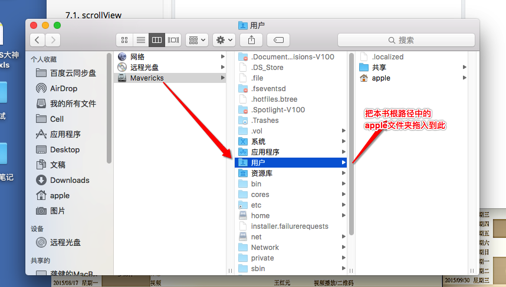

# Objective-C 和 iOS-UI

##如有不正确的地方还望改正

### 联系 64hp@163.com

### gitbook下载地址`https://github.com/NJHu/gitbook-dmg.git`

##`关于图片加载不了的的问题`

## 由于是离线图片所以需要另外导入路径

### 把本书中根路径的`**apple**`文件夹拖入到电脑用户文件夹

---
